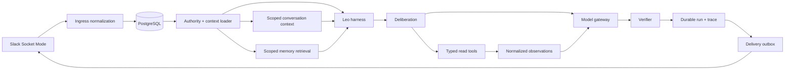

<p align="center">
  
</p>

<h1 align="center">Leo</h1>

<p align="center">
  AI Multi-Strategy Portfolio Manager Agent that lives in Slack
</p>

<p align="center">
  <a href="LICENSE">Apache-2.0</a> · Python 3.12–3.13 · Slack Socket Mode · PostgreSQL
</p>

Leo is a conversational assistant for Slack. It turns natural-language requests into bounded
model/tool turns, loads only authorized context, uses read-only research integrations when useful,
and posts a consolidated response back into the originating conversation. Every turn has
durable task, run, context, observation, verification, and delivery state.

The repository contains the application, the custom harness, provider adapters, Slack transport,
memory system, database migrations, deterministic fixtures, and evaluation suites in one Python
project.

## Contents

- [What Leo does](#what-leo-does)
- [Quick start](#quick-start)
- [Run modes](#run-modes)
- [Slack setup](#slack-setup)
- [Connected integrations](#connected-integrations)
- [Architecture](#architecture)
- [Harness design](#harness-design)
- [Context and memory](#context-and-memory)
- [Conversation behavior](#conversation-behavior)
- [Configuration](#configuration)
- [Railway deployment and operations](#railway-deployment-and-operations)
- [Testing and evaluations](#testing-and-evaluations)
- [Repository navigation](#repository-navigation)
- [Security and operating boundaries](#security-and-operating-boundaries)
- [License](#license)

## What Leo does

Leo accepts ordinary conversational messages rather than requiring users to select a workflow or
name a tool. Depending on the request, it can:

- answer from the current Slack conversation;
- ask one focused clarification when a request is genuinely underspecified;
- maintain a thread-local understanding of questions, answers, corrections, and decisions;
- retrieve relevant authorized memory without mixing unrelated conversations;
- research current equity, crypto, filing, news, and public-web information;
- compare options and explain trade-offs;
- use multiple independent read sources and summarize agreement, divergence, or time skew;
- create bounded read-only plans for independent research tasks;
- delegate read-only child tasks and synthesize their results in the parent run;
- recover from provider, model, context, delivery, and process interruptions;
- return useful conversational partials when complete work is not possible; and
- preserve a replayable trace without exposing internal run codes in Slack.

Leo's market capabilities are research tools, not trade execution. The application has no real-money
trading or external-write capability in its provider catalog. Market answers should be treated as
research information, not financial advice.

## Quick start

### Requirements

- Python 3.12 or 3.13
- [uv](https://docs.astral.sh/uv/)
- PostgreSQL or a compatible hosted PostgreSQL service for durable/live operation
- Slack app credentials for Slack operation
- An OpenRouter API key and a tool-capable model for live model turns

Provider credentials for web, market, crypto, and SEC capabilities are optional. The offline
smoke, evaluation, and unit-test paths do not require network credentials.

### Install

From the repository root:

```powershell
uv python install 3.13
uv python pin 3.13
uv sync --locked --dev
Copy-Item .env.example .env
```

On macOS/Linux, the last command is:

```bash
cp .env.example .env
```

Edit `.env` with the credentials required for the run mode you want. `.env` is ignored by Git;
`.env.example` contains names, defaults, and safe placeholders only.

### Initialize the database

Set `DATABASE_URL` to a TLS PostgreSQL connection or session-pooler URL on port 5432, then apply
the forward migrations:

```powershell
uv run alembic upgrade head
```

Leo uses PostgreSQL for durable Slack ingress, canonical conversations, context authority snapshots,
tasks, runs, events, observations, plans, memory, and the delivery outbox.

### Check configuration without printing secrets

```powershell
uv run leo check-config
```

The command reports missing variable names and capability availability. It never prints secret
values.

## Run modes

The `leo` command is defined in `src/leo/cli.py` and is installed by the project package.

### Offline development

These commands run with deterministic fixtures and do not call Slack, OpenRouter, Postgres, or
research providers:

```powershell
uv run leo smoke
uv run leo eval
uv run leo memory-eval
uv run leo run-fixture --help
uv run leo health
```

Useful offline scopes are:

| Command | Purpose |
| --- | --- |
| `leo smoke` | Runs a deterministic two-turn conversational quote fixture. |
| `leo eval` | Replays the versioned offline evaluation scenarios. |
| `leo memory-eval` | Runs the frozen memory retrieval benchmark and safety report. |
| `leo run-fixture` | Runs one named coordinator fixture and emits a sanitized timeline. |
| `leo health` | Reports safe local process, configuration, queue, and outbox health. |

### Slack transport and harness checks

```powershell
uv run leo slack-smoke
uv run leo slack-harness-smoke
```

`slack-smoke` exercises local Socket Mode normalization, deduplication, thread routing, and write
transport. `slack-harness-smoke` drives Slack-shaped input through Leo's deterministic custom loop
without live model or provider calls.

### Live Slack operation

After Slack credentials, `DATABASE_URL`, `OPENROUTER_API_KEY`, and `LEO_MODEL` are configured:

```powershell
uv run alembic upgrade head
uv run leo slack-live
```

`slack-live` runs the local Socket Mode listener and durable processing loop. It:

1. receives Slack events over an outbound WebSocket;
2. authenticates and admits only the pinned workspace and authorized conversations;
3. persists a sanitized ingress message and exact context authority snapshot;
4. creates or resumes a durable task and run;
5. loads scoped conversation context and memory;
6. runs the coordinator, model gateway, integrations, and verifier;
7. writes a durable delivery intent; and
8. posts the final response into the originating Slack thread.

The process can recover queued work and retryable outbox deliveries after restart. Stop the process
with the normal console interrupt before changing credentials or applying migrations.

### Provider and durable diagnostics

```powershell
uv run leo live-quote NVDA
uv run leo durable-quote NVDA
uv run leo replay RUN_ID
uv run python scripts/run_provider_smoke.py --output artifacts/provider-smoke-v1.json
```

`live-quote` is a narrow real-provider/verifier diagnostic. `durable-quote` exercises the same type
of model/provider path with atomic PostgreSQL state. `replay` reconstructs an exact persisted run
scope. The provider smoke runs one bounded read per configured provider and writes a sanitized
artifact containing typed status, counters, timestamps, and digests.

## Slack setup

Leo uses Slack Socket Mode, so local operation needs no public HTTP callback URL.

### Create the app

Apply [`slack/manifest.yml`](slack/manifest.yml) to a Slack app, enable Socket Mode, and create an
app-level token with `connections:write`. The manifest requests:

- bot scopes for mentions, message posting, channel/group/MPIM/DM discovery and history;
- optional user scopes for exact public/private/shared thread history reads; and
- `app_mention`, `message.im`, `message.channels`, `message.groups`, and `message.mpim` events.

Passive message events populate the context plane but do not launch model work or produce replies.
Mentions launch channel/group-DM turns. Human messages in a 1:1 DM launch turns without a mention.

Invite the bot to each channel or group DM where it should operate. Reinstall the app after changing
manifest scopes or event subscriptions.

### Configure Slack variables

```text
SLACK_APP_TOKEN=xapp-...
SLACK_BOT_TOKEN=xoxb-...
SLACK_USER_TOKEN=xoxp-...       # optional; used for exact channel-thread history reads
LEO_SLACK_TEAM_ID=T...
LEO_ORGANIZATION_ID=demo-org
LEO_STRATEGY_ID=technology-ls
```

The bot token is the authority for admission, membership, and posting. `SLACK_USER_TOKEN` is an
optional read-only history identity for public, private, and shared channel thread reads. In its
absence, Leo can use a persisted passive-event coverage snapshot only when it proves the complete
root-to-boundary range. It never silently substitutes an arbitrary recent message sample.

### Conversation routing

- 1:1 DMs: a message starts a turn without a mention.
- Public, private, shared, and external channels: Leo must be mentioned for a new turn.
- Group DMs/MPIMs: Leo must be mentioned for a new turn.
- Bot messages, edits, deletions, and unsupported subtypes: persisted as appropriate, but never
  used to trigger a response loop.
- Responses: posted in the originating thread, preserving the Slack conversation boundary.

## Connected integrations

Integrations are read-only capabilities exposed when their credentials and local health gates allow
them. Provider adapters accept documented response wrappers, aliases, missing optional metadata, and
safe primitive coercions, then normalize the result into Leo's internal observation format. A raw
provider wire response does not have to match one brittle schema before the next model turn can
reason over it.

| Integration | Environment | Capabilities |
| --- | --- | --- |
| Slack Socket Mode | `SLACK_APP_TOKEN`, `SLACK_BOT_TOKEN` | Events, mentions, DMs, thread history, membership, and responses. |
| OpenRouter | `OPENROUTER_API_KEY`, `LEO_MODEL` | Model requests. OpenRouter is a model gateway; Leo owns the loop, tools, budgets, and completion. |
| PostgreSQL/Supabase | `DATABASE_URL` | Durable message, task, run, event, context, memory, plan, replay, and outbox state. |
| Finnhub | `FINNHUB_API_KEY` | Quotes, company profiles, recent company news, earnings surprises, and selected basic financials. |
| Exa | `EXA_API_KEY` | Bounded URL-bound web search highlights. |
| Tavily | `TAVILY_API_KEY` | Bounded web discovery; selected results are fetched before they can support source claims. |
| Public web fetch | No key | Validated public HTTPS retrieval for selected pages. |
| Wikipedia | No key | Small public search and fetch path for discovery and retrieved text. |
| SEC EDGAR | `SEC_USER_AGENT` | Recent filings for supported tickers from SEC submissions data. |
| Alpha Vantage | `ALPHA_VANTAGE_API_KEY` | Equity quotes, symbol search, and company overview/profile. |
| Massive | `MASSIVE_API_KEY` | Equity snapshot/reference search and company metadata when the account tier permits it. |
| TickerLayer | `TICKER_LAYER_API_KEY` | Equity quotes, symbol search, and company metadata; quotes are labelled derived/indicative. |
| CoinGecko | `COINGECKO_API_KEY` or configured public access | Crypto market snapshots. |
| CoinMarketCap | `COIN_MARKET_CAP_API_KEY` | Crypto market snapshots and bounded credit telemetry. |
| MCP transport | Provider-specific endpoint variables | Negotiated tool transport with the same local authorization, effect, normalization, and verification boundaries. |

### Provider families and redundancy

The provider-neutral equity route can use Finnhub, Massive, TickerLayer, and Alpha Vantage. It keeps
successful provider observations, timestamps, references, and local failures so the model can
distinguish agreement, price divergence, and time skew. The crypto route can query CoinGecko and
CoinMarketCap independently and reports corroboration only when provider timestamps are close enough.

For web research, Exa provides URL-bound highlights. Tavily is discovery metadata; a selected URL is
fetched before its contents can support a grounded answer. A provider-local parse, entitlement,
quota, timeout, or health failure does not abort unrelated capabilities or an admitted provider
alternate.

## Architecture

The runtime is a durable pipeline with a custom harness in the center:



### Runtime layers

1. **Transport** — Slack Socket Mode receives events and posts replies. FastAPI/Uvicorn provide the
   small HTTP-facing application surface where used; Typer provides operator commands.
2. **Ingress and persistence** — Slack events are sanitized, deduplicated, assigned a canonical
   conversation identity, and committed before work is launched. PostgreSQL stores the durable
   task/run/outbox plane.
3. **Authority and context** — the runtime determines the exact destination, actor, workspace,
   membership, conversation history boundary, memory namespaces, and context budget before the
   model sees a request.
4. **Harness** — deliberation, capability selection, planning, delegation, tool execution, model
   turns, observation collection, verification, terminal quality, and tracing are application code
   under `src/leo/harness`.
5. **Integrations** — provider adapters perform bounded HTTP/MCP reads and normalize their outputs.
   They do not own the agent loop.
6. **Delivery** — a verified completion becomes an outbox intent. Slack delivery is reconciled with
   durable state so retries do not create duplicate replies.

## Harness design

Leo uses a model-assisted coordinator, not a framework-owned agent runtime. The application owns
iteration, authority, context selection, tool routing, budgets, persistence, verification, and
terminal truth.

### One turn at a time

Each model request is built from a typed `RunBundle` and a fresh `ModelRequest`:

1. The runtime creates an objective, task lineage, run phase, scope, and completion contract.
2. Deliberation scores ambiguity, context sufficiency, freshness/evidence needs, dependencies,
   effect risk, eligible tool health, information gain, and remaining budget.
3. The harness presents the model with only the permitted tools and selected context.
4. The model can answer, clarify, select a read, request independent reads, or prepare bounded
   delegation within the supplied policy.
5. Tool calls are validated for name, arguments, effect, phase, role, and budget before execution.
6. Integration results are recorded as normalized observations with provider, reference, freshness,
   and bounded payload metadata.
7. The next model request receives those observations and can reason through their actual normalized
   content to produce the answer or request the next allowed read.
8. The verifier checks completion against the request, evidence requirements, context authority,
   formatting constraints, and safety rules. Rejected work receives structured feedback for a
   bounded corrective model turn.
9. A verified result becomes durable terminal state and a Slack delivery intent.

The model never grants itself a new conversation, actor, organization, strategy, capability, or
write permission. A child task receives a least-needed projection of parent authority and can return
read-only evidence, but cannot post the final Slack answer or perform an external write.

### Flexible integration handling

Provider payloads are untrusted external input, but their wire shape is intentionally handled
tolerantly. Adapters normalize known wrappers and aliases, omit unknown bounded fields, and safely
coerce primitive values. The relaxed integration-grounding path lets the next model turn interpret a
provider observation as context instead of requiring the model to reproduce an exact provider
canonical string. Malformed, unsafe, truncated, unauthorized, or provenance-incomplete results are
still rejected. This preserves useful conversational behavior while keeping the external boundary
bounded.

### Budgets and stopping

The parent run defaults are controlled by environment variables:

```text
LEO_MAX_MODEL_TURNS=12
LEO_MAX_TOOL_CALLS=24
LEO_MAX_RUN_SECONDS=600
LEO_MAX_OUTPUT_TOKENS=2000
```

The coordinator stops on verified completion, useful clarification, a safe conversational partial,
deadline, exhausted work budget, repeated no-progress decisions, or an unrecoverable authority/
context failure. Internal terminal reason codes remain in the trace; Slack receives a bounded,
human-readable response and a useful next step.

### Verification and response rendering

The verifier is responsible for whether a run is complete, not for exposing internal tool details.
Slack rendering uses the model's consolidated answer and adds a financial-research disclaimer where
appropriate. Evidence, source, uncertainty, observation, verifier, and run metadata remain available
in durable records and replay artifacts rather than being appended to ordinary Slack messages.

## Context and memory

Context and memory are related but separate systems:

- **Context** is the evidence selected for the current turn: the exact Slack thread, authorized
  conversation turns, current task lineage, model observations, tools, skills, and verifier feedback.
- **Memory** is durable information deliberately promoted from a conversation or other authorized
  source for later retrieval.

### Context assembly

Every model request receives a manifest describing its inputs. The manifest includes source IDs,
content hashes, versions, inclusion decisions, estimated tokens/bytes, priority, pinned segments,
budget profile, and a manifest digest. The parent context budget defaults to 32,000 estimated tokens
and 128,000 bytes; child context is capped at 16,000 estimated tokens and 64,000 bytes.

Pinned segments include:

- the runtime protocol;
- authority and organization/strategy scope;
- the exact Slack destination and thread identity;
- task lineage and run state;
- the user objective;
- tool-choice policy;
- the completion contract; and
- required authority snapshots and verifier feedback.

Conversation turns, memory items, summaries, child results, observations, skills, and tool schemas
are selected by priority and budget. Older thread material can be compacted into source-linked
summary revisions with reopenable handles; the root, protected turns, corrections, unresolved
questions, tool outcomes, and Leo replies remain available according to the scope policy.

### Memory lifecycle

Memory records are append-only and revisioned. A record carries:

- a memory kind such as note, preference, or research context;
- a visibility plane and namespace;
- source references and hashes;
- actor and reason metadata;
- validity and expiration timestamps;
- sensitivity metadata; and
- an active, superseded, contested, or retracted status.

Supported visibility planes include thread-local, conversation-local, actor-private,
strategy-shared, and organization-shared. A candidate is not silently promoted because a model
mentioned it. Promotion requires the explicit memory workflow, duplicate detection, and conflict
handling. Retraction and bounded purge are separate lifecycle operations.

Retrieval applies scope, visibility, freshness, authorization, relevance, and budget before a memory
item becomes a context item. Search and navigation return source-linked records; summaries and
embeddings are derived data and never replace the authoritative source or expand access.

### Slack context boundaries

- Public/private/shared/external channels are isolated by exact Slack conversation and thread.
- Group DMs/MPIMs are isolated to the exact group.
- A 1:1 DM can use DM-local context plus a relevance-budgeted intersection of conversations that
  both the user and Leo can currently access in the same workspace.
- A group DM never receives the 1:1-DM union.
- Revoked membership, inaccessible sources, stale coverage, or an ambiguous history boundary removes
  that source or produces a context-unavailable response; Leo does not broaden access to compensate.

## Conversation behavior

Leo is designed to answer naturally. Users do not need to specify a tool, provider, workflow, or
delegation plan. A short conversational question may be answered directly. A current-data request
can trigger the appropriate market, filing, or web capability. A complex request can produce a
bounded plan, parallel reads, child research, and parent synthesis.

Typical prompts:

```text
@Leo What did we decide to call the demo?
@Leo Is the latest evidence for NVDA bullish or bearish?
@Leo What changed in the market today that matters for semiconductors?
@Leo Compare these two options and explain the trade-offs.
```

Leo's ordinary Slack response is the consolidated answer. It does not need to name the integration
that produced each fact. Provider/source metadata, exact observations, verifier feedback, and run
events remain in the durable trace for inspection and replay.

## Configuration

Copy `.env.example` to `.env`. Blank optional values disable their capability; they do not prevent
offline commands from running.

### Runtime and model

| Variable | Required for | Description |
| --- | --- | --- |
| `LEO_ENV` | — | Runtime environment label; defaults to `development`. |
| `LEO_LOG_LEVEL` | — | Log level; defaults to `INFO`. |
| `LEO_MODEL` | Live model turns | OpenRouter model identifier. |
| `LEO_MAX_MODEL_TURNS` | — | Maximum model decisions per run. |
| `LEO_MAX_TOOL_CALLS` | — | Maximum tool calls per run. |
| `LEO_MAX_RUN_SECONDS` | — | Wall-clock deadline per run. |
| `LEO_MAX_OUTPUT_TOKENS` | — | Maximum generated answer size. |

### Required live services

| Variable | Description |
| --- | --- |
| `OPENROUTER_API_KEY` | Model gateway credential. |
| `OPENROUTER_BASE_URL` | OpenRouter-compatible API base; the example points to the official API. |
| `DATABASE_URL` | TLS PostgreSQL or compatible Supabase connection. |
| `SLACK_APP_TOKEN` | Socket Mode app-level token with `connections:write`. |
| `SLACK_BOT_TOKEN` | Bot token used for Slack admission, membership, history, and posting. |
| `LEO_SLACK_TEAM_ID` | Pinned Slack workspace/team ID. |
| `LEO_ORGANIZATION_ID` | Internal organization scope. |
| `LEO_STRATEGY_ID` | Internal strategy/domain metadata. |

### Optional provider variables

| Provider | Variables |
| --- | --- |
| Slack history | `SLACK_USER_TOKEN` |
| Finnhub | `FINNHUB_API_KEY`, `FINNHUB_BASE_URL` |
| Tavily | `TAVILY_API_KEY`, optional `TAVILY_ENDPOINT`, local call limits |
| Exa | `EXA_API_KEY` |
| Alpha Vantage | `ALPHA_VANTAGE_API_KEY`, optional endpoint/limit settings |
| Massive | `MASSIVE_API_KEY`, optional endpoint/limit settings |
| TickerLayer | `TICKER_LAYER_API_KEY`, local call/month limits |
| CoinGecko | `COINGECKO_API_KEY`, `COINGECKO_BASE_URL`, optional MCP endpoint |
| CoinMarketCap | `COIN_MARKET_CAP_API_KEY`, `COIN_MARKET_CAP_BASE_URL` |
| SEC EDGAR | `SEC_USER_AGENT`, optional `SEC_EDGAR_BASE_URL` |

Rate/corroboration controls such as `EQUITY_QUOTE_AGREEMENT_THRESHOLD_PERCENT`,
`EQUITY_QUOTE_MAX_CORROBORATION_SKEW_SECONDS`, `CRYPTO_AGREEMENT_THRESHOLD_BPS`, and
`CRYPTO_MAX_CORROBORATION_SKEW_SECONDS` are also documented in `.env.example`.

## Railway deployment and operations

The hosted Leo deployment runs in one Railway project with three services. Slack replies are
processed by Railway, not by the developer laptop: `leo-slack` keeps a long-lived outbound Slack
Socket Mode connection and sends the reply after the durable run and delivery-outbox flow complete.
The laptop is only needed for development, Git pushes, and operator access.

### Hosted services

| Railway service | Runtime | Purpose |
| --- | --- | --- |
| `leo-slack` | `python -m leo slack-live` | Persistent Slack Socket Mode listener and reply worker. |
| `leo-dashboard-api` | `python scripts/run_dashboard_api.py` | FastAPI read-only monitoring API; runs Alembic migrations before deploy. |
| `leo-dashboard` | Next.js from `web/` | Monitoring dashboard that calls the API over HTTPS. |

The Slack service uses an outbound WebSocket and therefore does not need a public Slack callback
URL. The dashboard and API use Railway public domains. The current production links are:

- Dashboard: <https://leo-dashboard-production.up.railway.app>
- API health: <https://leo-dashboard-api-production.up.railway.app/health>

Railway domains can change if a service is renamed or its domain is regenerated; use the current
domains shown in the Railway project when updating CORS and dashboard variables.

The dashboard is read-only, but it currently has no user authentication. Treat the dashboard and
API URLs as public monitoring surfaces. Do not put secrets in dashboard-visible data, and add an
authentication or access-control layer before exposing sensitive operational information to
untrusted users.

### Railway service settings

The Python services use the repository-root `Dockerfile` for their build environment. The Slack
service uses the Dockerfile default command. The dashboard API overrides the start command and
uses this pre-deploy migration command:

```text
alembic upgrade head
```

The web service is configured with `web/` as its source root and uses:

```text
npm ci
npm run build
npm run start -- --hostname 0.0.0.0 --port $PORT
```

Railway supplies `$PORT`; applications must bind to `0.0.0.0`, not only to `127.0.0.1`.

### Railway variables

Set secrets through Railway Variables. Never commit `.env`, tokens, `DATABASE_URL`, or provider
keys. The important service-specific variables are:

`leo-slack`:

```text
LEO_ENV=development
LEO_MODEL=<OpenRouter model ID>
LEO_ORGANIZATION_ID=demo-org
LEO_STRATEGY_ID=technology-ls
LEO_SLACK_TEAM_ID=<Slack workspace/team ID>
SLACK_APP_TOKEN=xapp-...
SLACK_BOT_TOKEN=xoxb-...
OPENROUTER_API_KEY=...
DATABASE_URL=postgresql://...
FINNHUB_API_KEY=...
```

Add any other provider variables required by the capabilities you want enabled, such as
`EXA_API_KEY`, `TAVILY_API_KEY`, `MASSIVE_API_KEY`, `ALPHA_VANTAGE_API_KEY`,
`TICKER_LAYER_API_KEY`, `COINGECKO_API_KEY`, or `COIN_MARKET_CAP_API_KEY`. `SLACK_USER_TOKEN` is
optional and enables exact history reads for supported public/private/shared conversations.

`leo-dashboard-api`:

```text
DATABASE_URL=postgresql://...
LEO_DASHBOARD_CORS_ORIGINS=https://leo-dashboard-production.up.railway.app
```

If the dashboard domain changes, update `LEO_DASHBOARD_CORS_ORIGINS` to the exact new origin and
redeploy the API.

`leo-dashboard`:

```text
NEXT_PUBLIC_DASHBOARD_API_URL=https://leo-dashboard-api-production.up.railway.app
```

This is a public build-time variable, not a secret. It must point to the API origin without a
trailing path such as `/health`.

### Deploying a new version

The GitHub repository is `Aleksander2a/leo`, and the Railway services are connected to `main`.
The normal release flow is:

1. Create a feature branch and make the change.
2. Open a pull request. GitHub Actions runs the Python quality job on Python 3.12 and 3.13 and
   the dashboard lint/build job.
3. Merge the pull request into `main` after the checks pass.
4. Railway detects the push to `main` and builds/deploys the connected services. A push to the
   connected repository can start deployments for all three services because they share the
   repository.
5. Check the deployment status and service logs in Railway, then verify the API health URL and a
   real Slack reply.

For a direct push when that is appropriate:

```powershell
git add .
git commit -m "Describe the change"
git push origin main
```

Changing a Railway variable also normally triggers a new deployment. To rerun the same commit,
use Redeploy on the relevant Railway service. To undo a bad release, select a previous successful
deployment and redeploy it, then fix the source and push a new commit. Keep database changes
forward-only; do not use a production downgrade as a rollback strategy.

GitHub Actions is the repository quality signal. Railway's Git connection starts deployment from
the `main` push independently unless a separate Railway deployment gate has been configured, so
confirm the GitHub checks are green before merging rather than relying on a deployment to block a
bad commit.

### Monitoring and common operations

- `leo-slack` should remain running continuously. Its logs should show a successful Slack Socket
  Mode connection. Restarting the service is safe because tasks, runs, and delivery intents are
  durable in PostgreSQL.
- `leo-dashboard-api` should return HTTP 200 from `/health`. A failed health check usually means a
  missing/invalid `DATABASE_URL`, a migration failure, or a process that is not listening on the
  Railway port.
- `leo-dashboard` should report a successful Next.js build and start. If the page cannot load
  data, check both `NEXT_PUBLIC_DASHBOARD_API_URL` and the API's CORS origin.
- After changing Slack scopes, event subscriptions, or the app manifest, reinstall the Slack app
  and then restart/redeploy `leo-slack`.
- After adding a migration, verify the migration in CI and let the dashboard API deployment apply
  `alembic upgrade head` before exercising new dashboard fields.

### Local testing with Railway deployed

Run deterministic checks from the repository root without contacting Railway or live providers:

```powershell
uv sync --locked --dev
uv run leo smoke
uv run leo eval
uv run python scripts/quality.py
```

Run the dashboard locally with two terminals. First make sure `.env` points to a safe development
database; `alembic upgrade head` changes the database named by `DATABASE_URL`.

```powershell
# Terminal 1: API
uv run alembic upgrade head
uv run python scripts/run_dashboard_api.py
```

```powershell
# Terminal 2: web dashboard
cd web
npm ci
npm run dev
```

Set this in `web/.env.local` for the local web process:

```text
NEXT_PUBLIC_DASHBOARD_API_URL=http://127.0.0.1:8000
```

Open <http://localhost:3000> and check <http://127.0.0.1:8000/health>.

To test Slack against a local process, first stop or scale down the Railway `leo-slack` service,
then run:

```powershell
uv run leo slack-live
```

Do not run local and Railway listeners simultaneously with the same Slack app tokens: Socket Mode
events can be consumed by either listener and may result in missing or duplicate handling. For
regular development, prefer the offline smoke/evaluation commands, or use a separate Slack app
and development database for live transport tests.

## Testing and evaluations

### Full local quality gate

```powershell
uv run python scripts/quality.py
```

The quality gate performs a public-file secret scan, database-test safety checks, architecture and
dependency boundary checks, Ruff formatting/linting, strict mypy, the offline test suite, an offline
package build, and a clean-install smoke.

### Pytest

```powershell
uv run pytest -q
```

The test suite covers the harness, coordinator budgets, context manifests, Slack topology and
transport, persistence, memory lifecycle/retrieval, provider normalization, verifier behavior,
planning/delegation, replay, outbox recovery, and failure handling. PostgreSQL-specific tests live
under `tests/postgres` when present in the checkout and should use only a designated Leo test
database.

For a focused provider/verifier pass:

```powershell
uv run pytest -q tests/test_http_integrations.py `
  tests/test_research_adapters.py tests/test_exa_integration.py `
  tests/test_crypto_market_tools.py tests/test_equity_provider_expansion.py `
  tests/test_provider_runtime_health.py tests/test_provider_smoke_operator.py `
  tests/test_verifier_grounding.py tests/test_capability_runtime.py `
  tests/test_live_composition.py
```

### Evaluation fixtures

Versioned scenarios in `evals/scenarios` cover:

- conversational answers and clarification;
- budget boundaries and safe failure;
- channel isolation and DM context unions;
- Slack thread authority and long-thread compaction;
- parallel reads and delegated dependency plans;
- provider failure recovery and tool recall;
- memory lifecycle;
- restart/replay/idempotency; and
- verifier correction and grounded research.

Evaluation output is sanitized and intended for `artifacts/` or another local ignored directory.
It contains typed outcomes and trace metadata rather than credentials or unrestricted provider
payloads.

## Repository navigation

```text
.
├── src/leo/
│   ├── api/              HTTP application surface
│   ├── capabilities/     Capability catalog, routing, adapters, and tool descriptors
│   ├── domain/           Conversation and domain models/ports
│   ├── evals/            Evaluation runners, fixtures, reports, and live-proof operators
│   ├── harness/          Coordinator, context, planning, tools, observations, verification
│   ├── integrations/     OpenRouter, Slack, web, market, crypto, SEC, MCP, and HTTP adapters
│   ├── memory/           Memory records, policies, retrieval, projection, compaction, lifecycle
│   ├── persistence/      PostgreSQL stores, loaders, leases, migrations, and outbox
│   ├── worker/           Durable task execution and Slack conversation runtime
│   ├── cli.py            Typer operator commands
│   ├── config.py         Typed environment configuration
│   └── live.py           Live runtime composition and service wiring
├── assets/               Repository media, including the Leo logo
├── evals/
│   ├── scenarios/        Versioned harness scenarios
│   └── fixtures/         Memory corpora and frozen reports
├── migrations/           Alembic migration history
├── resources/leo-skills/ Skill metadata and bounded procedures
├── scripts/              Quality, provider smoke, benchmark, and database operators
├── slack/                Slack app manifest
├── tests/                Unit, contract, integration-shape, and runtime tests
├── web/                  Local web-facing assets/configuration
├── .env.example          Safe configuration template
├── alembic.ini           Database migration configuration
├── pyproject.toml         Package, dependency, CLI, Ruff, mypy, and pytest configuration
├── uv.lock               Reproducible dependency lockfile
├── .github/workflows/    GitHub Actions CI configuration
├── LICENSE               Apache License 2.0
└── README.md             Project, runtime, architecture, and operations guide
```

### Where to make common changes

| Change | Primary location |
| --- | --- |
| Add or alter a model/tool turn | `src/leo/harness/coordinator.py`, `deliberation.py`, and `models.py` |
| Add a read capability | `src/leo/capabilities/`, `src/leo/harness/tools.py`, and `src/leo/integrations/` |
| Add a provider adapter | `src/leo/integrations/`, provider descriptors, normalization, and provider tests |
| Change Slack event behavior | `src/leo/integrations/slack/` and `src/leo/persistence/slack_*.py` |
| Change context authority/loading | `src/leo/harness/context.py`, `src/leo/harness/thread_context.py`, and `src/leo/persistence/context_loader.py` |
| Change memory retrieval or lifecycle | `src/leo/memory/` and matching persistence modules |
| Change durable schema | Add a forward migration under `migrations/versions/` and update persistence models |
| Add an evaluation | Add a scenario under `evals/scenarios/` and coverage under `tests/` |
| Change environment settings | `src/leo/config.py` and `.env.example` |
| Change operator commands | `src/leo/cli.py` |

The harness core stays independent from Slack, HTTP, SQLAlchemy, and provider modules. Transport and
storage are connected through typed ports and composition in the live/runtime modules.

## Security and operating boundaries

- Never commit `.env`, tokens, API keys, database URLs, or raw provider responses containing secrets.
- Slack message text is sanitized and sensitive assignment-like values are redacted before storage.
- External URLs are validated for public-address policy, redirect safety, response size, and content
  type before retrieved text can become evidence.
- Provider call gates bound concurrency, local call windows, cooldowns, and response size. They are
  process-lifetime safeguards, not a billing ledger.
- Research tools are read-only. Write effects are not available in the research phase.
- Context authority is determined by the runtime and persisted with the turn. Model text cannot
  expand scope or membership.
- Durable terminal state is separate from Slack delivery. An unknown delivery effect is reconciled
  rather than blindly reposted.
- Logs, health output, smoke artifacts, and replay output are designed to be secret-free.
- Financial content is informational research and does not constitute investment advice.

## License

Leo is distributed under the [Apache License 2.0](LICENSE).
