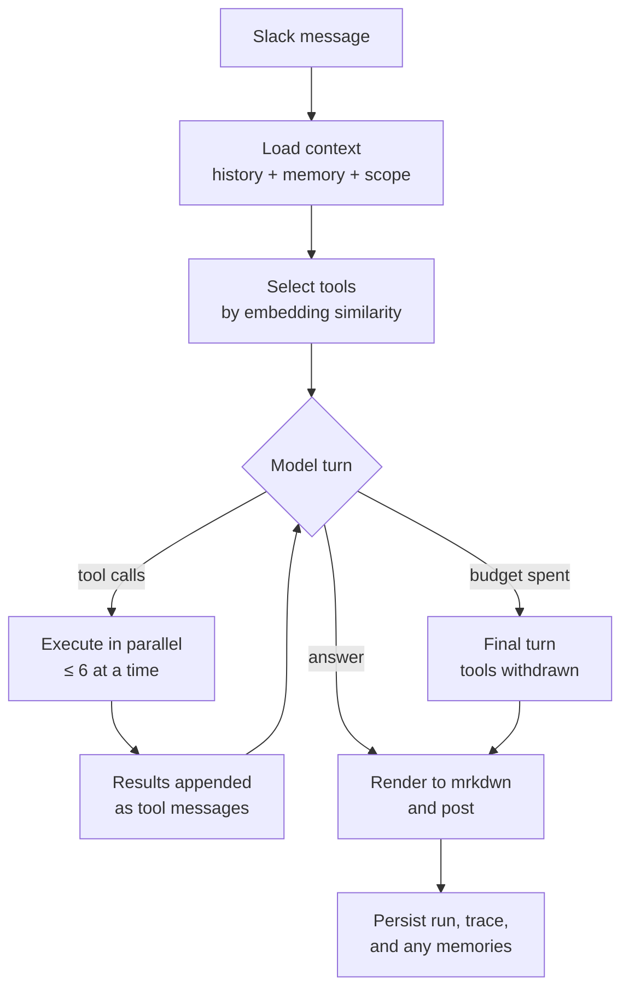

<p align="center">
  
</p>

<h1 align="center">Leo</h1>

<p align="center">
  <b>An AI portfolio-research agent that lives in Slack.</b><br>
  Built on a custom agent harness.
</p>

<p align="center">
  <a href="LICENSE"></a>
  
  
  
</p>

<p align="center">
  <a href="https://leo-dashboard-production.up.railway.app/"><b>→ Live dashboard</b></a>
</p>

---

Mention Leo in Slack and ask it something. It works out what it needs to know, finds and calls the
right tools, iterates, and replies.

```
@Leo what high yield crypto strategy should I adopt now?
```

```
Leo  ·  Working on it…
Leo  ·  Checking web.search_tavily…
Leo  ·  Here's my honest take, not a sales pitch. "High yield" in crypto almost always
        means you're getting paid to take on risk someone else won't…
```

Every one of those steps is recorded and inspectable on the
[dashboard](https://leo-dashboard-production.up.railway.app/): the tools Leo used, the
exact arguments it sent, what each provider returned, and the answer.

## Contents

- [What Leo does](#what-leo-does)
- [Using Leo in Slack](#using-leo-in-slack)
- [The agent harness](#the-agent-harness)
  - [The loop](#the-loop)
  - [Context engineering](#context-engineering)
  - [Tool calling](#tool-calling)
  - [Tool discovery](#tool-discovery)
  - [Memory](#memory)
  - [Isolation](#isolation)
- [What the database stores](#what-the-database-stores)
- [The tool catalogue](#the-tool-catalogue)
- [Dashboard](#dashboard)
- [Running it yourself](#running-it-yourself)
- [Configuration](#configuration)
- [Deployment](#deployment)
- [Repository map](#repository-map)
- [Testing and quality](#testing-and-quality)
- [Extending Leo](#extending-leo)
  - [Add a tool](#add-a-tool)
  - [Change how Leo behaves](#change-how-leo-behaves)
  - [Add a surface](#add-a-surface)
  - [Change the schema](#change-the-schema)
- [Operating boundaries](#operating-boundaries)
- [License](#license)

## What Leo does

- **Answers market and company questions with live data.** Crypto snapshots corroborated
  across two providers, equity quotes and profiles that fail over between four, earnings
  surprises, company news, basic financials, and SEC filings for any EDGAR-registered ticker.
- **Researches the open web.** Search across Tavily and Exa, fetch and read a page, or run a
  search-then-fetch chain that falls back to a second provider when the first is down.
- **Reasons, rather than looking things up.** Strategy, mechanics, trade-offs, and frameworks
  come from the model. It only reaches for a tool when the answer depends on something it
  cannot know: a current price, a recent filing, or something you told it before.
- **Remembers your situation, per conversation.** Holdings, risk tolerance, constraints, and
  decisions — written when you state them, recalled by meaning, revised when they change.
- **Keeps conversations separate.** What Leo learns in a DM never surfaces in a channel.
- **Always replies.** Every message Leo accepts gets an answer. If something genuinely broke,
  the reply says what broke, in words you can act on.
- **Shows its work.** Every turn, tool call, argument, and payload is stored and browsable.

Leo's market tools are **read-only research**. There is no trading capability anywhere in the
system.

## Using Leo in Slack

> **Leo only speaks when spoken to.** In a channel you must `@Leo` — it never responds to
> messages that do not mention it, and it never reads a conversation it was not addressed in.
> In a direct message, every message is a question and no mention is needed.

**In a channel.** Mention Leo and ask. It replies in a thread on your message, so a long
answer doesn't flood the channel. Mention it inside an existing thread and it stays there.

**In a DM.** Just talk to it.

**While it works.** Leo posts `Working on it…` immediately, then updates that same message
with the tools it is calling as it calls them — so you can see it searching the web or
pulling a quote — and finally replaces it with the answer. Answers longer than one Slack
block continue as follow-up messages in the same thread.

**Formatting.** Answers are converted to Slack's mrkdwn on the way out, so bold, bullets,
code, and links render properly rather than arriving as raw Markdown asterisks.

**Memory.** Tell Leo something durable and it will keep it: *"I hold 3 BTC and never want
more than a 15% drawdown."* Ask later — *"given what you know about me, how should I size a
crypto position?"* — and it answers against that. Correct it and it revises, keeping the old
version in history.

## The agent harness

Leo's harness is **written from scratch for this project**. There is no LangChain, no
LangGraph, no CrewAI, no AutoGen, no agent framework of any kind. The dependency list is a
model client, an HTTP client, a database driver, and a Slack SDK.

The design rule the whole package obeys:

> **The model is the agent. The harness serves it.**
>
> The harness supplies context, runs the tools the model asks for, keeps both within budget,
> and stores what happened.

### The loop



Each turn the model either calls tools or writes the answer. Tool results come back as
ordinary `tool` messages and the model decides what to do next. It ends when the model stops
asking for tools.

Three properties make this reliable:

**Every tool outcome returns to the model.** A missing tool, malformed arguments, a provider
outage, a timeout, an oversize payload — each one comes back as a `tool` message describing
exactly what happened, so the model can try another source, narrow the query, or answer with
what it already has. In [`tools.py`](src/leo/agent/tools.py) each of those cases is packaged
as a `ToolResult` and handed back, which is why a dead provider reads as information rather
than a dead end.

**Every answer is model-written.** When the turn budget runs out, the model gets one final
call with tools withdrawn and an instruction to answer with what it gathered, so the last word
is always its own. Claims in an answer therefore trace back to a model that read the evidence,
and if the model provider itself is unreachable Leo reports that plainly.

**Repeated calls are answered from cache.** If the model issues an identical call twice, the
first result comes back with a note saying so — the budget goes on new evidence.

Budgets are per-turn and configurable: 12 model turns, 24 tool calls, 600 seconds by default.
A wall-clock overrun triggers the same final-answer turn as a spent budget.

### Context engineering

The prompt for a turn is assembled fresh, in this order:

| Segment | Contents |
| --- | --- |
| **System** | Leo's identity, how the loop works, how to answer, memory policy, Slack formatting, the current date, and where it is speaking. |
| **Memory** | The memories most semantically relevant to this question — injected as background it already knows, so ordinary questions need no memory tool call. |
| **History** | The last 24 turns of this conversation, oldest first, capped at 24,000 characters. |
| **Question** | The user's message, with Slack's own markup stripped and URLs preserved. |

Two decisions are worth calling out.

**History is answers, not transcripts.** A run's raw tool traffic is stored as a trace, not as
conversation history. Replaying old tool JSON into later prompts fills the window with noise;
the next turn reads what Leo *said*, not the sixty kilobytes of search results behind it.

**Oversize payloads are trimmed to fit.** A tool result larger than its declared ceiling is
shrunk by halving its largest field repeatedly — strings keep their leading text, lists keep
their head — so a long filing arrives partial and still usable. If the model provider
reports a context overflow anyway, the loop sheds the oldest complete tool exchange (the
assistant call *and* all of its results, since splitting the pair is rejected outright) and
retries.

### Tool calling

Tools use the provider's **native function-calling** interface. A tool is one class with three
members, defined in [`contracts.py`](src/leo/agent/contracts.py):

```python
class MyTool:
    @property
    def spec(self) -> ToolSpec: ...                    # name, description, JSON schema, limits
    def validate(self, arguments) -> dict: ...          # reject bad input before any I/O
    async def execute(self, arguments, context) -> ToolOutcome: ...   # ToolSuccess | ToolFailure
```

`ToolSuccess` carries the data, a `SourceRef` (provider, reference, optional URL), and an
observation timestamp — so an answer's provenance is recorded rather than asserted.
`ToolFailure` carries a code and a message written **for the model to read**: `"Symbol NVDAA
not found; check the ticker"` produces a correction on the next turn, where `"Error 400"`
produces a guess.

Execution is parallel — up to six calls per batch — with a per-tool timeout, argument
validation against the declared schema, and result-size trimming. Every outcome, successful or
not, becomes a message the model sees.

### Tool discovery

Leo carries 35 tools. Putting all of them in front of the model on every turn invites
scattershot calling, so each turn opens with the ones that are *semantically close to what was
actually asked*.

Each tool's `name (domain): description` is embedded once with
`openai/text-embedding-3-small` (1536 dimensions, via OpenRouter) and cached in Postgres,
keyed by a fingerprint of the text so a changed description re-embeds itself. At turn time
the question is embedded and tools are ranked by cosine similarity.

Selection is **entirely semantic**: a tool's own description is what makes it discoverable, so
writing a good description *is* the integration work.

Ranking decides what a turn *opens* with; the whole catalogue stays reachable throughout:

- **Eight tools are always available**, whatever the question: the three memory tools,
  `tools.find`, and four web routes. Leo can always remember and always research.
- **The top-ranked tools fill the turn** up to a budget of 14.
- **`tools.find` reaches everything else.** The model describes what it needs — *"historical
  crypto prices"*, *"SEC filings for a ticker"* — searches the same index, and gets back
  matching tools that become callable on its next turn.

### Memory

Leo remembers per conversation, through three tools it calls itself:

| Tool | What it does |
| --- | --- |
| `memory.search` | Finds memories by meaning, using pgvector cosine distance. |
| `memory.write` | Stores a durable fact, preference, decision, context note, or task. |
| `memory.forget` | Retires a memory that is no longer true. |

**Recall is semantic.** *"What's my risk tolerance?"* finds *"never wants more than 15%
drawdown"* without sharing a single keyword. The top 8 matches inside a relevance threshold
are injected into the system prompt before the first turn, so ordinary questions are answered
against what Leo knows without spending a tool call. If nothing clears the bar — or the
embedding provider is unavailable — recall falls back to the scope's most important memories
rather than reporting amnesia.

**Updates supersede.** Revising a memory writes a new row and marks the old one inactive,
pointing it at its replacement. The chain stays readable, so you can see
what Leo used to believe and when it changed:

```
superseded   Holds 3 BTC.
active       Holds 5 BTC (updated from 3).
```

**Writes are the model's judgement.** Leo is told to store things that will still be true next
week — a preference, a constraint, a position, a decision — and *not* to store facts it looked
up on the web, which go stale.

Inspect or prune from the terminal:

```bash
uv run leo memory list --scope slack:T0123ABC:D0456DEF
uv run leo memory forget --scope slack:T0123ABC:D0456DEF mem-…
```

### Isolation

Every durable row carries a `scope_key`: `slack:<team>:<channel>`. A channel and a DM are
different scopes, and so are two different channels.

Isolation is a **`WHERE` clause on every read**. A channel's query returns that channel's rows
and only those rows; the database itself is the boundary. The same key bounds conversation
history, run listings, memory recall, and the dashboard's filters, so one mechanism covers
every feature — and a test that inserts into two scopes and reads one back proves it end to
end.

## What the database stores

Everything lives in **Supabase Postgres** with the `pgvector` extension, in six tables:

| Table | Holds | Notes |
| --- | --- | --- |
| `agent_conversations` | One row per channel or DM. | `scope_key` is unique; everything else hangs off it. |
| `agent_messages` | What was asked and what Leo answered. | Partial unique index on `(scope_key, external_id)` makes Slack's event redelivery idempotent. |
| `agent_runs` | One request end to end. | Status, question, answer, error, turns, tool calls, tokens, cost, timings. |
| `agent_steps` | The reason–act trace. | Every model turn and tool call in order, with arguments and payload as JSONB. |
| `agent_memories` | Durable facts. | `vector(1536)` embedding with an HNSW cosine index; `superseded_by` links revisions. |
| `agent_tool_index` | Cached tool-description embeddings. | Fingerprinted, so a changed description re-embeds automatically. |

Messages, runs, and steps cascade from their conversation, so removing a conversation removes
everything it owned. Schema changes are Alembic migrations in `migrations/`, and the schema
ships as a single baseline migration.

Writing the trace is best-effort by design: if a step record fails to persist, the run
carries on and answers. Diagnostics are worth having, and worth less than the answer.

## The tool catalogue

35 tools, all optional — Leo advertises whatever the deployment is credentialed for and works
without the rest.

| Domain | Tools | Providers |
| --- | --- | --- |
| **Web** (7) | Search, fetch a page, and a search-then-fetch chain with provider failover. | Tavily, Exa, Wikipedia, Tavily MCP |
| **Crypto** (4) | Per-provider snapshots plus a corroborated aggregate reporting cross-provider agreement and time skew. | CoinGecko, CoinMarketCap, CoinGecko MCP |
| **Equities** (16) | Quotes, company profiles, and symbol search, each with a provider-neutral route that fails over, plus direct per-provider routes for diagnosis. | Finnhub, Alpha Vantage, Massive, TickerLayer, Alpha Vantage MCP |
| **Fundamentals** (3) | Company news, earnings surprises, basic financials. | Finnhub |
| **Filings** (1) | Recent EDGAR filings for any registered ticker, resolved from SEC's own published index. | SEC EDGAR |
| **Memory** (3) | Search, write, forget — scoped to the conversation. | Leo |
| **Meta** (1) | `tools.find`, semantic search over the catalogue itself. | Leo |

MCP-sourced tools sit alongside the REST adapters, so the model may call both for the same
fact and reconcile them itself. An MCP tool satisfies the same interface as any other,
is ranked by the same index, and reports failures the same way.

## Dashboard

**[leo-dashboard-production.up.railway.app](https://leo-dashboard-production.up.railway.app/)**

A read-only Next.js app over a FastAPI service that queries the same six tables.

| Page | Answers |
| --- | --- |
| **Overview** | Is it working? Answer rate, runs per day, cost, latency percentiles, per-tool reliability, and which tool errors are most common. |
| **Runs** | What has it been asked? Filterable by status and conversation, searchable across questions and answers. |
| **Run detail** | *What did it actually do?* The reason–act trace: each model turn with the tools it requested and what it wrote, each tool call expandable to its exact arguments, source, URL, and returned payload. |
| **Conversations** | Transcript, runs, and memory for one channel or DM, side by side — the clearest place to see scope isolation actually holding. |
| **Memory** | What does it remember, where, and how has that changed? Searchable, filterable, with full revision history. |
| **Tools** | What can it reach, what is indexed, what gets used, and what fails. |
| **Failures** | Runs that ended without an answer, with the tool errors from inside them as context. |

One thing the UI states deliberately: **a failing tool call is not a failure.** The Failures
page stays empty while the loop is recovering normally — tool error codes live on Overview and
Tools instead.

> The dashboard is read-only but has no authentication. Treat the URL as a public monitoring
> surface, and add an auth layer before exposing operational data to untrusted viewers.

## Running it yourself

### Requirements

- Python 3.12 and [uv](https://docs.astral.sh/uv/)
- PostgreSQL with `pgvector` — [Supabase](https://supabase.com) works out of the box
- An OpenRouter API key and a tool-capable model
- Slack app credentials, for the Slack surface
- Node 22, for the dashboard

Provider credentials (web search, market data, SEC) are all optional and additive.

### Setup

```bash
uv python install 3.12
uv python pin 3.12
uv sync --locked --dev
cp .env.example .env          # then fill it in
uv run alembic upgrade head   # creates the six tables
uv run leo health             # verifies credentials, database, and tool count
```

### Talk to it from the terminal

No Slack required — the same agent, the same tools, the same memory:

```bash
uv run leo ask "what high yield crypto strategy should I adopt now?" --trace
uv run leo chat
```

`--trace` prints each tool call as it happens.

### Run it on Slack

Create a Slack app from [`slack/manifest.yml`](slack/manifest.yml), enable Socket Mode,
install it to your workspace, and put the bot token (`xoxb-…`) and app-level token (`xapp-…`)
in `.env`. Invite Leo to any channel where it should answer; DMs need no invitation.

```bash
uv run leo slack
```

Socket Mode connects outbound over WebSockets, so Leo runs anywhere with internet access — a
laptop, a container, a Railway service. [`docs/slack-local.md`](docs/slack-local.md) is the
full runbook, including token rotation and removing Leo from a conversation.

### Run the dashboard locally

```bash
uv run python scripts/run_dashboard_api.py   # http://127.0.0.1:8000
npm --prefix web run dev                     # http://localhost:3000
```

### CLI reference

| Command | Does |
| --- | --- |
| `leo ask "…"` | One question, one answer. `--scope` picks the conversation, `--trace` shows tool calls. |
| `leo chat` | An interactive multi-turn session. |
| `leo slack` | Runs the Slack Socket Mode service until stopped. |
| `leo health` | Checks credentials, database reachability, and lists available tools. |
| `leo memory list --scope …` | Shows what Leo remembers for one conversation. |
| `leo memory forget --scope … <id>` | Retires one memory. |

## Configuration

Everything is environment variables — see [`.env.example`](.env.example) for the full list.

**Required**

| Variable | Purpose |
| --- | --- |
| `LEO_MODEL` | Any tool-capable OpenRouter model. |
| `OPENROUTER_API_KEY` | Model inference and embeddings. |
| `DATABASE_URL` | Postgres with `pgvector`. Use the direct or session-pooler URL on port 5432 — not transaction mode. |

**Slack surface**

| Variable | Purpose |
| --- | --- |
| `SLACK_BOT_TOKEN` | `xoxb-…`, for reading events and posting. |
| `SLACK_APP_TOKEN` | `xapp-…` with `connections:write`, for Socket Mode. |
| `LEO_SLACK_TEAM_ID` | Optional; Leo reads its own identity from `auth.test`. |

**Budgets**

| Variable | Default | Purpose |
| --- | --- | --- |
| `LEO_MAX_MODEL_TURNS` | 12 | Reason/act rounds per question. |
| `LEO_MAX_TOOL_CALLS` | 24 | Tool calls per question. |
| `LEO_MAX_RUN_SECONDS` | 600 | Wall-clock budget per question. |
| `LEO_MAX_OUTPUT_TOKENS` | 4000 | Per model turn. |
| `LEO_SLACK_WORKER_CONCURRENCY` | 4 | Questions handled at once. |

**Providers** — all optional: `TAVILY_API_KEY`, `EXA_API_KEY`, `FINNHUB_API_KEY`,
`COINGECKO_API_KEY`, `COIN_MARKET_CAP_API_KEY`, `ALPHA_VANTAGE_API_KEY`, `MASSIVE_API_KEY`,
`TICKER_LAYER_API_KEY`, `SEC_USER_AGENT`, plus MCP endpoints for Tavily, Alpha Vantage, and
CoinGecko.

Secrets are held as `SecretStr` and redacted from log output by
[`safe_logging.py`](src/leo/safe_logging.py); `.env` is gitignored, and the quality gate scans
the tree for credential-shaped strings on every run.

## Deployment

Leo runs as **three Railway services in one project**, all deploying from `main` in
[`Aleksander2a/leo`](https://github.com/Aleksander2a/leo). Railway rebuilds the affected
service on every push; GitHub Actions runs the Python and dashboard quality gates on pushes
and pull requests.

| Service | Start command | Exposed |
| --- | --- | --- |
| `leo-slack` | `python -m leo slack` — the long-running Socket Mode agent. | No domain. Outbound WebSockets only. |
| `leo-dashboard-api` | The FastAPI read API, applying Alembic migrations before each deploy. | Railway domain, consumed by the dashboard. |
| `leo-dashboard` | The Next.js dashboard. | [leo-dashboard-production.up.railway.app](https://leo-dashboard-production.up.railway.app/) |

The database is **Supabase Postgres** with `pgvector`, shared by all three services and
reached over TLS on port 5432 (direct or session-pooler, never transaction mode — the agent
relies on session state that transaction pooling breaks).

**Service variables**

- `leo-slack` — `LEO_MODEL`, `OPENROUTER_API_KEY`, `DATABASE_URL`, `SLACK_BOT_TOKEN`,
  `SLACK_APP_TOKEN`, plus whichever provider keys should be live.
- `leo-dashboard-api` — `DATABASE_URL`, and `LEO_DASHBOARD_CORS_ORIGINS` set to the dashboard
  domain.
- `leo-dashboard` — `NEXT_PUBLIC_DASHBOARD_API_URL` set to the API domain. This is read at
  build time, so changing it requires a redeploy.

The [`Dockerfile`](Dockerfile) builds the Python image for both backend services; the entry
point differs by service. `leo-slack` takes its command from the Dockerfile's `CMD`, and
`tests/test_entrypoints.py` asserts that command still resolves — so leave Railway's *Start
Command* field empty for that service rather than duplicating the value somewhere CI cannot
see it. [`docs/railway-deployment.md`](docs/railway-deployment.md) has the
operational detail.

## Repository map

```
src/leo/
├── agent/                 the agent — everything below is framework-free, hand-written
│   ├── loop.py            ← the reason–act loop. Start here.
│   ├── prompts.py         the system prompt: identity, method, answering, memory, formatting
│   ├── tools.py           the registry — schemas out, results back, nothing fatal
│   ├── discovery.py       semantic tool selection, and the tools.find meta-tool
│   ├── memory.py          scope-isolated recall, write, supersede, forget
│   ├── llm.py             OpenAI-compatible chat + embeddings, with transport resilience
│   ├── contracts.py       the value types a tool and the loop agree on
│   ├── store.py           conversations, history, runs, traces
│   ├── schema.py          the six tables
│   ├── db.py              engine, sessions, and the event loop psycopg requires
│   └── runtime.py         composition root: builds the tool set and runs one turn
├── slack/
│   ├── app.py             Socket Mode transport — guarantees a reply, always
│   └── render.py          Markdown → Slack mrkdwn, and message chunking
├── integrations/          provider tool adapters (HTTP and MCP), one file per provider
├── providers/             provider-domain normalization — pure functions over payloads
├── api/                   the read-only dashboard API
├── cli.py                 ask · chat · slack · health · memory
└── config.py              settings, loaded from the environment

web/                       the Next.js dashboard
migrations/                Alembic — one baseline migration
tests/                     142 tests
docs/                      Slack runbook, Railway runbook, tool-authoring guide
scripts/quality.py         the single quality gate
```

**Reading it for the first time?** [`loop.py`](src/leo/agent/loop.py) then
[`tools.py`](src/leo/agent/tools.py) gives you the entire reasoning model in about 650 lines.
[`prompts.py`](src/leo/agent/prompts.py) is where behaviour is specified — in language the
model reads, not in code that inspects its output.

**Layering** is enforced by the quality gate: the agent may not import a transport
(`leo.slack`, `leo.api`, `slack_bolt`, `fastapi`), and `providers/` may not import the agent
loop. So the loop can be reasoned about, and tested, entirely on its own.

## Testing and quality

```bash
uv run pytest tests -q            # 142 tests
uv run python scripts/quality.py  # the full gate
```

The gate runs a secret scan, a destructive-migration check, the layering check, `ruff format`,
`ruff check`, `mypy --strict`, the test suite, a migration compile, and a wheel build followed
by a clean-install import smoke test. The dashboard has its own gate: `npm --prefix web run
lint` and `npm --prefix web run build`. Both run in CI on every push and pull request.

Tests that need a database skip themselves when `DATABASE_URL` is unset, and the ones that use
it clean up after themselves — a session teardown purges the `test:` scope prefix, so the
dashboard stays readable.

The suite is organised by the guarantee it protects: `test_loop.py` covers the reasoning loop's
contract (a failing tool never ends a run, a spent budget still produces a model-written
answer, a provider outage is reported truthfully), `test_tool_registry.py` covers every way a
tool can misbehave, `test_memory.py` covers isolation and supersession, and `test_slack.py`
covers the transport's promise that every accepted message gets a reply.

## Extending Leo

**Leo is built to be extended.** Two design decisions make a new capability cheap:

- **A capability is a class.** Everything Leo can do — search the web, price a coin, read a
  filing, remember a fact — implements the same three-member interface, and the loop treats
  them all identically. A new one plugs straight in.
- **A description is the routing.** Tools are found by embedding similarity over their own
  descriptions, so a tool becomes reachable the moment it exists. What you write in the
  `description` field decides when Leo reaches for it.

Together they put a new capability entirely in **two files**: the adapter itself, and the one
line that registers it.

### Add a tool

**1. Write the class** — `src/leo/integrations/<your_provider>.py`

```python
class TreasuryYieldTool:
    @property
    def spec(self) -> ToolSpec:
        return ToolSpec(
            name="market.get_treasury_yield",
            # Written for the model, and for the index that ranks it. Say what
            # question this answers, in the words someone would ask it.
            description=(
                "Current US Treasury yield curve: the yield on 1-month through 30-year "
                "Treasury bills, notes, and bonds. Use for risk-free rates, the shape of "
                "the curve, or comparing a yield against government debt."
            ),
            domain="market",
            input_schema={...},   # JSON Schema; the loop validates against it
            timeout_seconds=20.0,
            max_result_bytes=8192,
        )

    def validate(self, arguments): ...        # raise on bad input, before any I/O
    async def execute(self, arguments, context):
        ...
        return ToolSuccess(data=..., source=SourceRef(...), observed_at=...)
```

**2. Register it** — one line in `build_tools` in
[`runtime.py`](src/leo/agent/runtime.py), gated on whatever credential it needs:

```python
if is_configured_secret(settings.treasury_api_key):
    tools.append(TreasuryYieldTool(client=client, clock=clock))
```

**3. Run it.** The next turn embeds the description, caches the vector in `agent_tool_index`,
and the tool is live — ranked against real questions and reachable through `tools.find`.
`leo health` lists it; the [Tools page](https://leo-dashboard-production.up.railway.app/tools)
shows its call count and failure codes as soon as it is used.

[`docs/adding-a-tool.md`](docs/adding-a-tool.md) has the complete worked example, including
how to write failure messages the model can act on and where provider-domain logic belongs.

### Change how Leo behaves

Edit [`prompts.py`](src/leo/agent/prompts.py). How deeply Leo researches, when it writes a
memory, how it handles uncertainty, how it formats an answer — all of it is specified in
prose, in the file the model actually reads. Behaviour changes are prose edits, and you can
check them immediately with `leo ask "…" --trace`.

### Add a surface

Write a transport alongside [`slack/`](src/leo/slack), which is 451 lines end to end. The
agent exposes a single entry point:

```python
async with runtime(settings) as agent:
    result = await agent.handle(TurnRequest(question=..., scope=Scope(key=...)))
```

`TurnRequest` in, `AgentResult` out. The agent depends on those two types and nothing else,
which is enforced by the quality gate's layering check — so a Discord bot, an HTTP endpoint,
or a cron job reuses the whole harness as-is.

### Change the schema

Add the column or table to [`schema.py`](src/leo/agent/schema.py), then generate a migration:

```bash
uv run alembic revision --autogenerate -m "what changed"
uv run alembic upgrade head
```

Storage helpers live in [`store.py`](src/leo/agent/store.py); the dashboard reads the same
models, so exposing a new field means adding it to
[`api/dashboard.py`](src/leo/api/dashboard.py) and its TypeScript counterpart in
`web/src/lib/types.ts`.

## Operating boundaries

- **Read-only markets.** No trading, no order placement, no external write capability
  anywhere in the tool set. Market answers are research, not financial advice.
- **Read-only dashboard.** Every endpoint is a `GET`.
- **Conversation-bounded.** Leo answers from what it has recorded in the conversation it is
  speaking in. It cannot read a channel it was not addressed in, or a thread it did not
  participate in.
- **Bounded outbound requests.** Page fetches go through a policy that rejects non-HTTPS
  schemes, embedded credentials, and private hosts ([`safe_fetch.py`](src/leo/integrations/safe_fetch.py)),
  URLs found inside provider payloads are validated before use
  ([`url_policy.py`](src/leo/url_policy.py)), and every provider sits behind a rate and
  concurrency gate.
- **Secrets stay out of logs.** Configured credentials are redacted from log records, and CI
  scans the repository for credential-shaped strings.

## License

[Apache-2.0](LICENSE).
